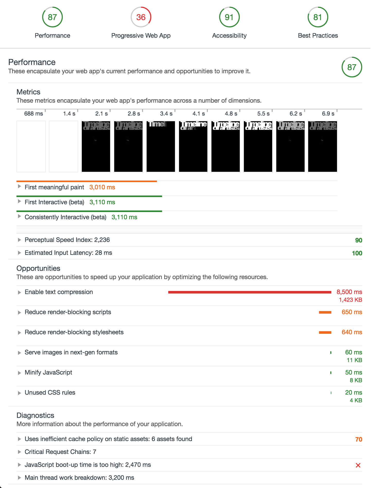
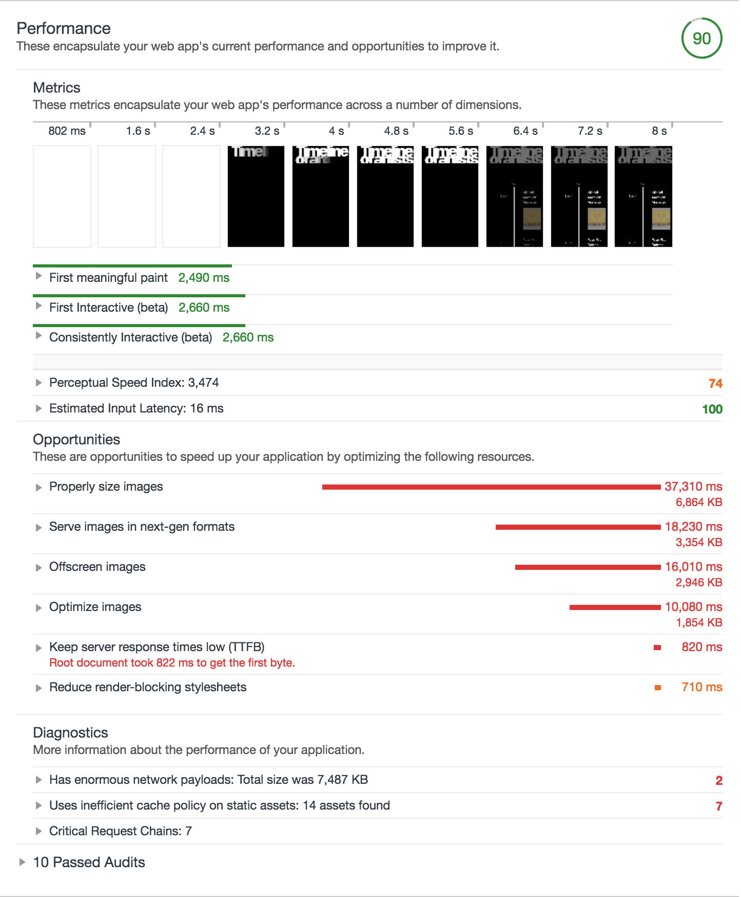
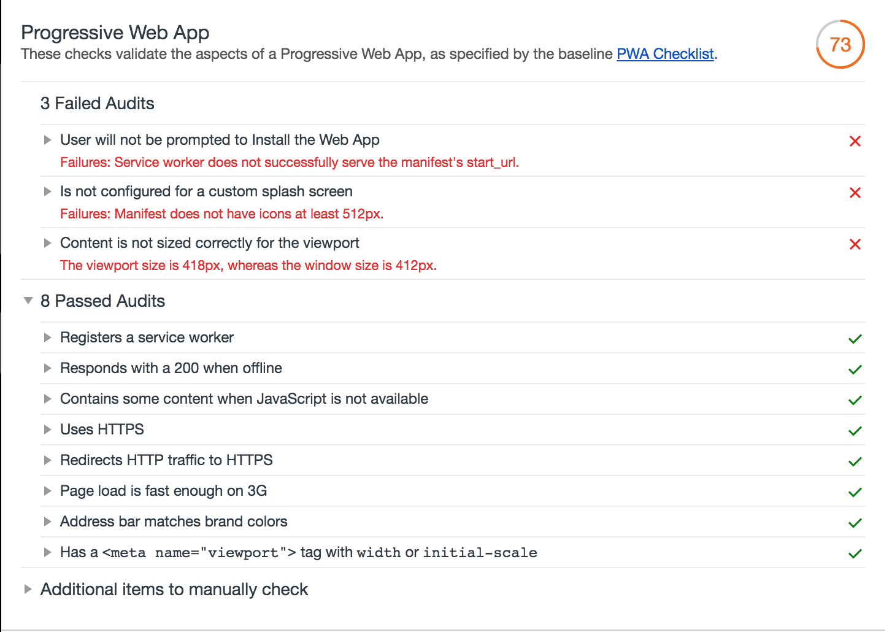
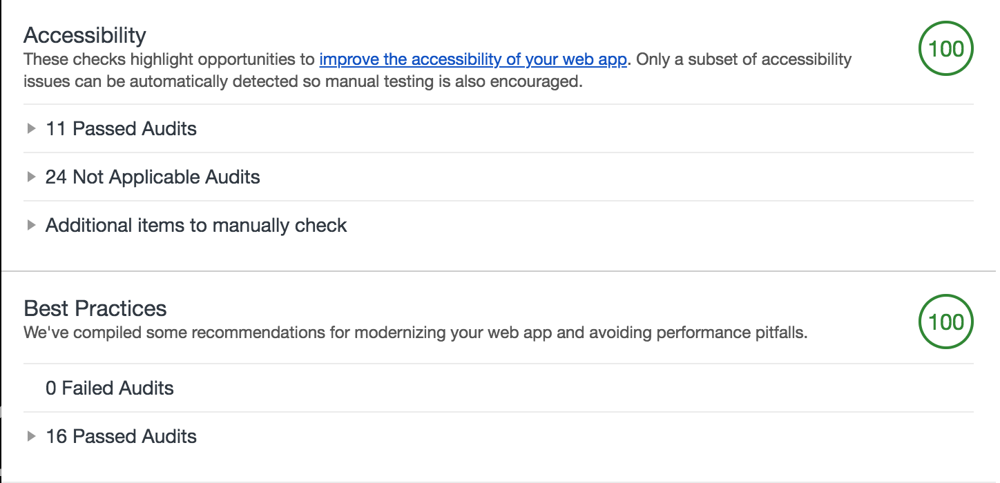

# Timeline of Artists
## Performance matters
### Serverside application

## Concept
This is a website that displays a timeline of artists in Amsterdam during the Golden Age.

It portrays the name, birthyear and deathyear of the artists.

When navigating to an artist you can see his work in a chronological timeline.

## Build
For this build I used:
- ES6 modules
- Express & Node.js
- Express request
- GSAP Libraries

## Functionality
 Works without JavaScript
 Server: express
 Data from Adamnet

## NPM scripts

### Run all
This will start a Node server with bundled and compiled JS and SCSS to compressed CSS.
```javascript
"dev": "parallelshell \"npm run start\" \"npm run build-js\" \"npm run build-css\""
```

## Audit

### Before


No serverside rendering

### Performance



- ~90/100
- Slow images are caused by API
- Uses system fonts

#### To increase performance further
I tried to get the images and resize/compress them before sending them to the client but I failed.
To increase performance most I need to find a way to resize/compress the images.

### Progressive web app



- ~73/100
- App is installable
- Install prompt will fire on further navigating
- Has working Service Worker / manifest

### Accessibility and Best Practices



- 100/100 on both
- Good color contrast
- Keyboard accessible
- Aria labeled when needed

## Future
In the future I want to: 
- Compress the images
- Add critical CSS
- Add lazy loading